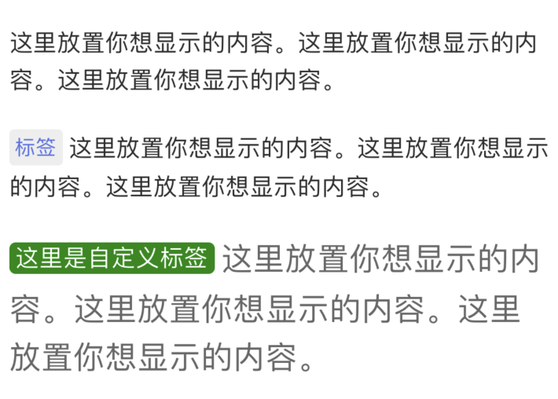

# React Native JRTagText

带标签的Text，效果见下图：



查看示例代码：[Example/App.js](https://github.com/tulip09020618/react-native-jrtagtext/blob/master/Example/App.js)

## 安装
`npm install react-native-jrtagtext --save`

## 用法
* 1. 导入

`import JRTagText from 'react-native-jrtagtext';`

* 2. 使用

```
<JRTagText 
    tag="标签"
    content="这里放置你想显示的内容。这里放置你想显示的内容。这里放置你想显示的内容。"
/>
```

* 3. 效果：


## 属性说明
| 属性 | 类型 | 描述 |
| :-: | :-: | :-: |
| tag | String  | 标签，不传或传空字符串，不显示标签 |
| content | String  | 内容 |
| style | View Style Object | 最外层容器属性 |
| contentLineHeight | int | 内容和标签行高（默认为23） |
| tagBackStyle | View Style Object | 设置标签的背景视图属性 |
| tagTextStyle | Text Style Object | 设置标签的文本属性 |
| contentTextStyle | Text Style Object | 设置内容的文本属性 |

说明：所有属性均为非必传属性。


